# MPP MES — User Journeys

**Project:** Madison Precision Products MES Replacement
**Purpose:** Narrative walkthrough of the two primary user experiences — Configuration and Plant Floor
**Status:** Working draft — assumptions and open decisions flagged at end
**References:** `MPP_MES_SUMMARY.md`, `MPP_MES_DATA_MODEL.md`, Scope Matrix

---

## Revision History

| Version | Date | Author | Change Summary |
|---|---|---|---|
| 0.1 | 2026-04-06 | Blue Ridge Automation | Initial user journeys — 2 narrative arcs, 19 assumptions, impact matrix, validation log |
| 0.2 | 2026-04-09 | Blue Ridge Automation | Added decision text and status tags to all 19 assumptions. 4 resolved (UJ-06, UJ-15 + mapped OI-01, OI-08, OI-09). 8 pending customer validation, 4 pending internal review (Ben), 7 remain open. Added status legend. |
| 0.3 | 2026-04-09 | Blue Ridge Automation | UpperCamelCase naming convention applied to all DB references. Department references updated to Area per ISA-95. |
| 0.4 | 2026-04-10 | Blue Ridge Automation | Location model references updated for the new three-tier polymorphic model (LocationType → LocationTypeDefinition → LocationAttributeDefinition). See FDS v0.4 for details. |
| 0.5 | 2026-04-15 | Blue Ridge Automation | Aligned to data model v1.3 and Phase 5/6 SQL delivery. Configuration Tool arc now reflects three-state versioning (Draft / Published / Deprecated) for RouteTemplate, OperationTemplate, and Bom — engineers author across sessions, publish to release for production, and deprecate rather than delete. OperationTemplate data collection described via the DataCollectionField junction (configurable per step) instead of hardcoded flags. Location management references the SortOrder + MoveUp/MoveDown arrow-button pattern (no drag-and-drop, per project convention). Plant Floor arc references HoldEvent as a single place/release lifecycle table consistent with DowntimeEvent. Added note that all Configuration Tool screens bind to Ignition Named Queries over stored procs returning a single result set (see FDS §11 FDS-11-011). |
| 0.6 | 2026-04-16 | Hunter Kraft | Mockup screenshots reviewed and incorporated into Arc 1 narrative. UI details (screen names, field labels, button labels, layout descriptions) updated to match the actual Perspective mockup. In progress — updating section by section as screenshots are reviewed. |

---

## Two Story Arcs

The MES has two fundamentally different audiences using the same underlying data model:

| Arc | Who | When | What They See |
|---|---|---|---|
| **Configuration Tool** | Engineers, production control, IT | Before production, during setup changes | Plant model, item master, routes, specs, code tables |
| **Plant Floor MES** | Operators, supervisors, quality, shipping | Every shift, all day | LOT creation, production recording, container packing, holds |

The configuration tool creates the rules. The plant floor MES enforces them.

---

## Arc 1: The Configuration Tool — "Before the First Part Moves"

Before a single LOT can be created on the shop floor, an engineer at Madison Precision Products has to teach the MES what the plant looks like, what it makes, and how it makes it. This is the configuration tool — the Ignition Perspective application that probably lives behind a different navigation root than the shop floor screens, accessible only to users whose AD accounts carry an engineering or admin role in Ignition.

### Building the Plant

The engineer's first job is the plant model. They navigate to the **Plant** category in the left rail and open the **Plant Hierarchy** screen. The left panel shows the full location tree — each node labeled with its ISA-95 tier on the right (Enterprise, Site, Area, Cell). A **Search locations...** bar at the top of the tree lets them jump directly to any location by name. The **+ Add Location** button in the top right of the screen opens the creation flow.

The hierarchy is built top-down. Madison Precision Products is the Enterprise. Under it, Madison Facility is the Site. Under that, the Areas: Die Cast, Trim Shop, Machine Shop, Production Control, Quality Control. Under each area, the individual machines as Cells — all ~230 of them.

When the engineer clicks **+ Add Location**, a modal appears with four fields: **Location Type Definition** (a dropdown that sets both the ISA-95 tier and the polymorphic kind — e.g., `Cell • DieCastMachine`), **Name** (e.g., DC Machine #20), **Code** (e.g., DC-020), and an optional **Description**. Clicking **Create Location** adds the new node to the tree and opens its detail panel for attribute entry. Cancel dismisses without saving.

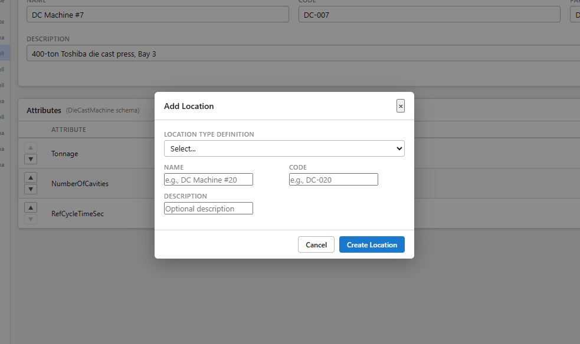

Clicking any node in the tree loads its **Location Details** panel on the right. The panel header shows the location's type tags — for example, `Cell • DieCastMachine` — so the engineer always knows both the ISA-95 tier and the polymorphic kind at a glance. The core fields are **Name**, **Code**, **Parent**, **Description**, and **Sort Order**. **Save** and **Deprecate** actions sit in the top-right corner of the panel.

Below the core fields, the **Attributes** section displays the schema for that location's kind. DC Machine #7, for example, shows the `DieCastMachine` schema: **Tonnage** (400, DECIMAL, tons — required), **NumberOfCavities** (2, INT — required), and **RefCycleTimeSec** (62.5, DECIMAL, sec — optional). Each attribute row has up/down arrows on the left for reordering. The data type and UOM are shown inline next to the value field, and the **REQ** checkbox indicates whether the attribute is mandatory for that location kind. The engineer fills in the values for each machine as they work through the hierarchy.

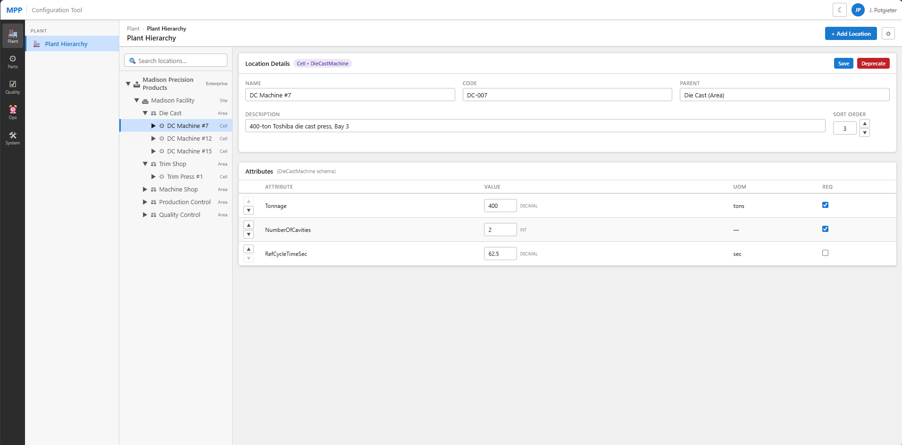

They also create the logical locations: Receiving Dock, Shipping Dock, WIP Storage, Sort Cage. These are Inventory Location types — they don't have cycle times, but they're real places where LOTs live.

Then they set up terminals. Each Ignition client station on the floor gets a `Terminal` record — its IP address, which location it's at, which Zebra printer it talks to, whether it has a barcode scanner. This is how the system knows that when operator Maria scans a LOT at terminal DC-05, that action happened at Die Cast Machine #5, and any label it prints goes to the Zebra on the table next to her.

### Defining How We Make It

Before items can have routes, the engineer needs to define the **Operation Templates** — the reusable data collection profiles that describe what each type of operation requires. The engineer navigates to **Parts › Operation Templates**. The left panel groups templates by area: Die Cast, Trim Shop, Machine Shop, Assembly. Each template in the list shows its name and version badge. Clicking a template loads its detail on the right: **Code** (e.g., DIE-CAST), **Name** (Die Cast Operation), **Area** (Die Cast dropdown), and **Description** (free-text summary, e.g., "Primary die cast operation with die, cavity, weight, and count collection."). Below, the **Data Collection Fields** table lists every field the operation captures — columns are **Field** and **Required**. For Die Cast Operation v2, five fields are configured: CollectsDieInfo ✓, CollectsCavityInfo ✓, CollectsWeight ✓, CollectsGoodCount ✓, CollectsBadCount □ (not required in this version). Each field row has up/down arrows for reordering and a **Remove** button; the **+ Add Field** button in the top right of the table adds a new field to the template. A **New Version** button clones the published template into a draft for editing — published templates are read-only.

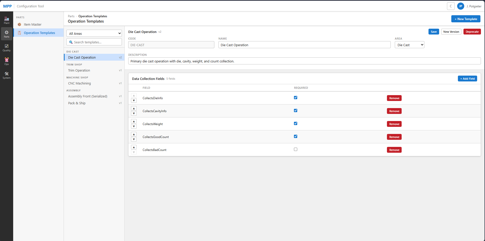

With templates defined, the engineer moves to the item master to create parts and attach routes that reference them.

### Defining What We Make

Next, the item master. The engineer navigates to the **Parts** category in the left rail and opens the **Item Master** screen. The left panel shows a searchable, filterable list of all items — a **Search items...** bar at the top and an **All Types** dropdown to filter by item type (Finished Good, Component, Pass-Through, etc.). Each item in the list shows its part number, description, and a type badge (FG, COMP, PT).

Clicking an item loads its detail panel on the right. The header shows the part number, name, and a status badge (e.g., **Finished Good**), with **Save** and **Deprecate** buttons in the top-right corner. The core fields are: **Part Number**, **Item Type** (dropdown), **UOM** (dropdown), **Description**, **Macola Part #** (ERP cross-reference), **Unit Weight**, **Weight UOM**, **Default Sub-Lot Qty** (how many pieces per sub-LOT when a parent LOT splits at machining), and **Max Lot Size** (reasonability check ceiling).

Below the core fields, a five-tab strip gives access to all item-related configuration: **Container Config**, **Routes**, **BOMs**, **Quality Specs**, and **Eligibility**.

When the engineer clicks **+ Add Item**, a modal appears organized into four sections: **Identity** (Part Number — required, Item Type dropdown — required, UOM dropdown — required), **Description** (required), **Weight** (Unit Weight and Weight UOM dropdown), **Lot Configuration** (Default Sub-Lot Qty defaulting to 24, Max Lot Size defaulting to 100), and **ERP Integration** (Macola Part # — optional, for future Macola integration). Clicking **Create Item** adds the item and opens its detail panel.

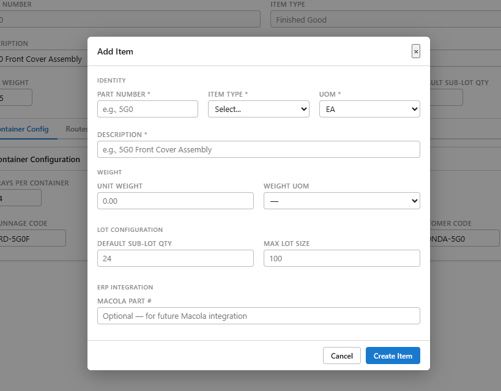

The **Container Config** tab defines Honda packing rules for finished goods. For the 5G0 Front Cover Assembly: **Trays Per Container** = 4, **Parts Per Tray** = 12, **Serialized** = Yes, **Dunnage Code** = RD-5G0F, **Customer Code** = HONDA-5G0. These values drive the container lifecycle on the floor — the MES knows exactly when a container is full and what label to print.

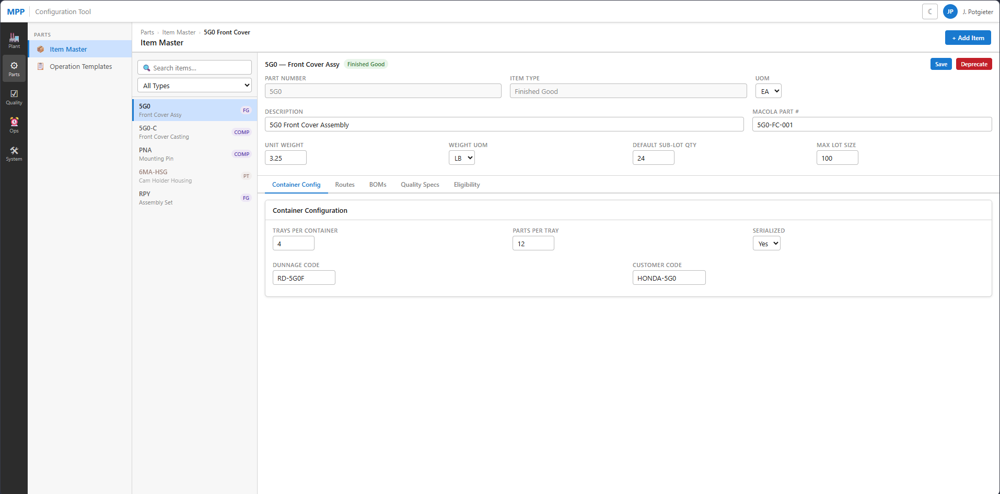

The **Routes tab** shows the active route version for the item. A version dropdown (e.g., "v2 — Effective 2026-01-15") displays the current version alongside its lifecycle badge (**Published**, **Draft**, or **Deprecated**). A **New Version** button clones the published route into a new draft for editing. The route steps table shows: step number, **Step Name**, **Area**, and **Data Collection** — a summary of what data fields are collected at each step. Each step references an operation template — the Die Cast step pulls from Die Cast Operation v2, which determines the specific fields shown in the Data Collection column. For the 5G0, the published v2 route has 5 steps: Die Cast (Die Cast area — Die, Cavity, Weight, Good, Bad), Trim (Trim Shop — Weight, Good, Bad), CNC Machining (Machine Shop — Good, Bad), Assembly Front (Die Cast — Serial, Material Verify, Good, Bad), and Pack & Ship (Prod Control — Good). A footer note reminds the user that published routes are read-only.

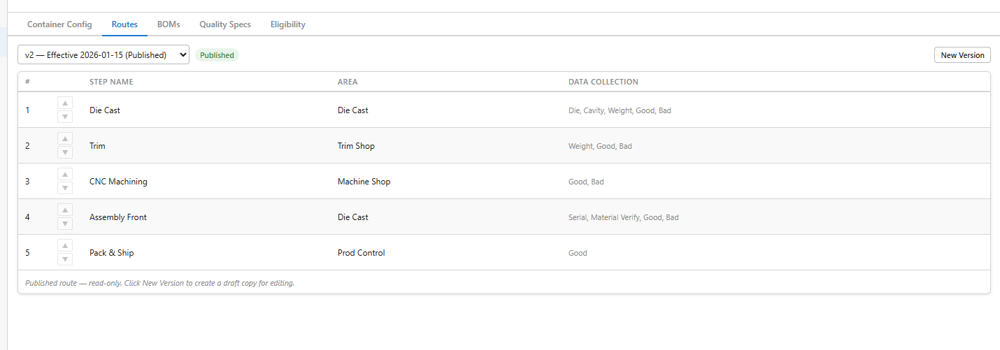

The **BOMs tab** follows the same versioned pattern. The 5G0's v1 Published BOM shows two components in sequence order: Front Cover Casting (5G0-C, qty 1 EA) and Mounting Pin (PNA, qty 2 EA). Published BOMs are read-only; **New Version** clones into a draft for editing.

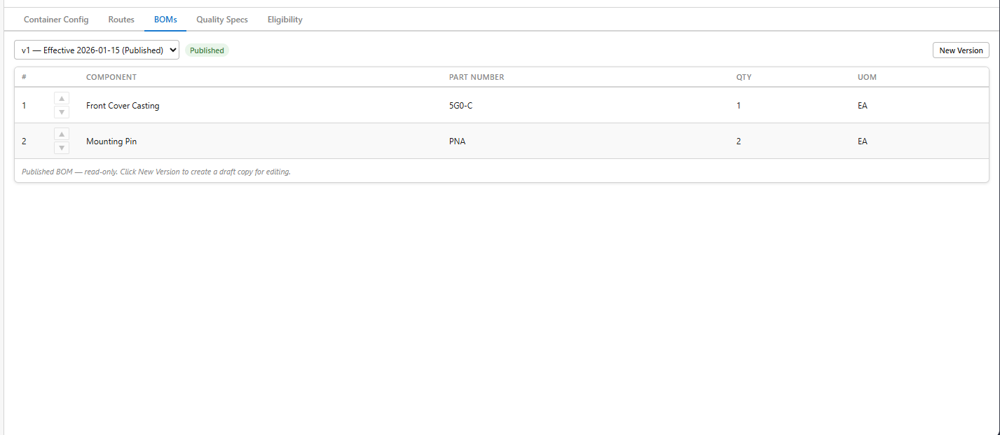

The **Quality Specs tab** shows all quality specs linked to this item. Rather than editing specs inline, it displays a summary table — **Spec Name**, **Active Version**, **Status** — with a **Go to spec →** button that navigates directly to the full spec in the Quality Specs library. The 5G0 has two linked specs: 5G0 Dimensional Spec (v2, Published) and 5G0 Visual Inspection (v1, Published).

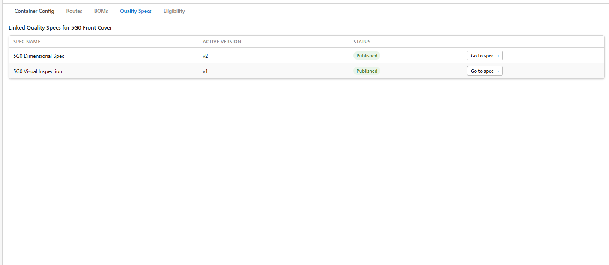

The **Eligibility tab** defines which machines can run this part. An **Area** dropdown filters the view by area. For the 5G0 in the Die Cast area, the table shows all four Die Cast machines with their codes and tonnage, and an **Eligible** checkbox for each. DC Machine #3 (400t), #7 (400t), and #12 (400t) are checked; DC Machine #15 (250t) is unchecked — the 5G0 requires 400-ton capacity.

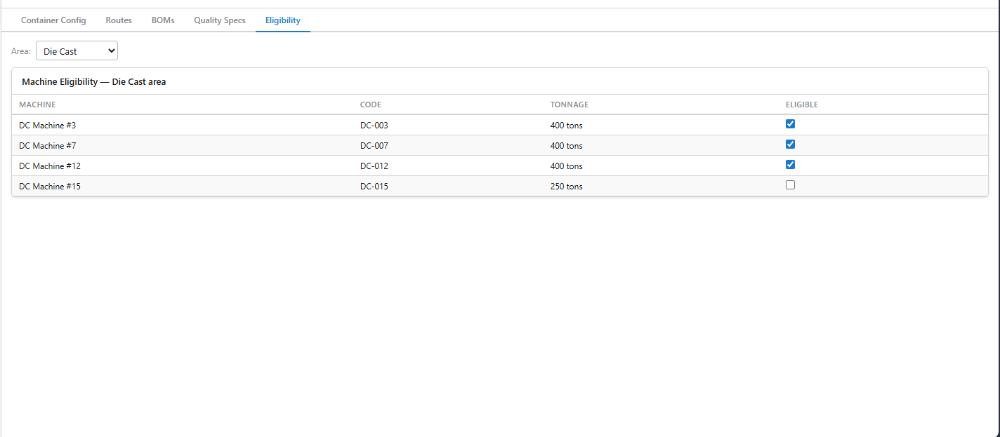

### Defining Quality Standards

Quality specs are managed in the **Quality › Quality Specs** screen. The left panel has an item filter dropdown (e.g., 5G0 Front Cover) and lists all specs for that item — each showing its name, lifecycle status badge (Published, Draft), and version number. A separate spec can be in Draft for the same item while the prior version remains Published; the floor uses the Published version until the new one is explicitly published. Clicking a spec loads its full definition on the right: **Linked Item**, **Linked Operation** (e.g., CNC Machining), the effective date, and the version/status. The **Attributes** tab shows a table of every measurement in the spec with columns for **Attribute Name**, **Type**, **Target**, **Lower Limit**, **Upper Limit**, **UOM**, and **Trigger** (how often to sample). For the 5G0 Dimensional Spec v2: Surface Flatness (DECIMAL, target 0.002, lower 0.001, upper 0.003, in, FirstPiece), Bore Diameter (DECIMAL, target 25.40, lower 25.38, upper 25.42, mm, FirstPiece), and Porosity Visual (PASS/FAIL, target Pass, no numeric limits, Hourly). Each row defines exactly what the inspector enters on the floor and whether it's a dimensional check or a pass/fail judgment. A **New Version** button clones the current spec into a draft for revision; published specs are read-only.

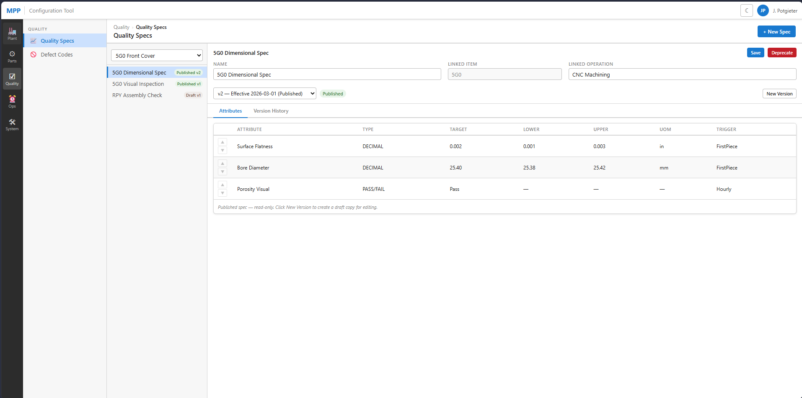

Defect codes are managed in the **Quality › Defect Codes** screen. The left panel has an **Area** filter dropdown (All Areas, Die Cast, Machine Shop, Trim Shop, HSP), a **Search** field, and an **Include Deprecated** checkbox. The right panel is a table: **Code**, **Description**, **Area**, **Excused** checkbox, and **Edit** button. Die Cast codes include DC-0135 Porosity, DC-0136 Cold Shut, DC-0137 Flash (excused ✓), DC-0138 Misrun. Machine Shop: MS-0001 Dimensional(OOT), MS-0143 Surface Finish, MS-0154 Tool Marks. Trim Shop: TS-0101 Burr—Trim. HSP vendor-part codes: HSP-0247 Vendor Defect—Dimensional. Clicking **Edit** on any row opens an inline editor for the description, area, and excused flag. The excused flag marks defects that are expected process variation — they're tracked in full but don't penalize OEE quality scores.

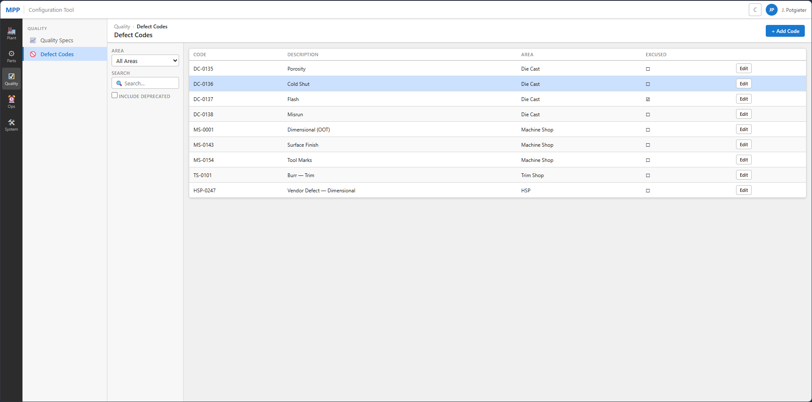

### Defining Downtime Vocabulary

Downtime reason codes are managed in the **Operations › Downtime Codes** screen. The left panel has an **Area** filter, a **Reason Type** filter (All Types, Equipment, Setup, Quality, Mold), a **Search** field, and an **Include Deprecated** checkbox. The right panel is a table: **Code**, **Description**, **Area**, **Type**, **Excused** checkbox, and **Edit** button. Die Cast codes include DC-0001 Die Stuck (Equipment), DC-0002 Hydraulic Leak (Equipment), DC-0015 Mold Change (Setup, excused ✓ — scheduled mold changes don't penalize availability), DC-0030 Quality Hold—Line Stop (Quality). Machine Shop: MS-0001 Tool Change (Setup, excused ✓), MS-0010 Spindle Error (Equipment). Trim Shop: TS-0001 Trim Die Repair (Mold). The excused flag determines whether a downtime event is included in the OEE availability denominator — planned maintenance, required setup, and mold changes are typically excused so they don't artificially depress the score. Clicking **Edit** opens an inline editor for the code's description, area, type, and excused flag.

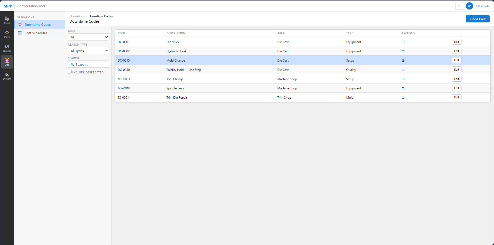

Shift schedules are managed in the **Operations › Shift Schedules** screen. The table shows each schedule's **Name**, **Start** time, **End** time, **Days** (shown as M T W T F S S pill buttons — active days filled blue, inactive hollow), **Effective** date, and an **Edit** button. Three schedules are configured: First Shift (06:00–14:00, Mon–Fri, effective 2026-01-01), Second Shift (14:00–22:00, Mon–Fri, effective 2026-01-01), and Weekend OT (06:00–16:00, Sat–Sun only, effective 2026-01-01). The day-pill display makes it immediately clear which shifts cover weekends — Weekend OT shows only the S–S pills filled, while the weekday shifts show M–F filled with S–S hollow. Clicking **Edit** opens an inline editor for the times, day selection, and effective date.

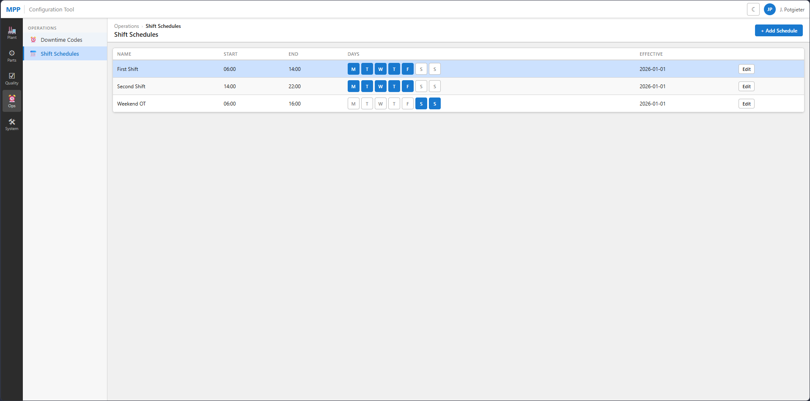

Every one of these configuration changes is logged to `ConfigLog` — who changed what, when, what the old value was.

---

## Arc 2: The Plant Floor MES — "A Day in the Life of a LOT"

It's 6:15am on a Tuesday. First shift has started. The aluminum is already molten.

### 6:20am — Die Cast: A LOT Is Born

Carlos is running die cast machine #7 today. He's making 5G0 Front Covers — die #42, cavity B. The furnace is hot, the die is locked, and the first shot cycle completes. The casting drops into the trim press, gets trimmed, and falls into the basket beside his station.

Carlos has a stack of pre-printed LOT Tracking Tickets — barcoded labels, each with a unique LOT ID (MPP pre-prints these in batches per FRS 2.2.1). He peels one off — LOT `2026-04-06-0001` — and sticks it on the basket. He turns to the Ignition terminal next to his machine, scans the LTT barcode, and the MES opens the LOT creation screen. The terminal knows he's Carlos (he badged in with his clock number and PIN at shift start), but he must manually enter the production data: Part Number 5G0, Die #42, Cavity B, and the piece count — 48 parts in this basket (per FRS 2.2.2: "operators manually key that data into the MES"). The MES validates: is 48 ≤ max lot size for 5G0? Yes. Is 5G0 eligible to run on machine #7? Yes.

He also enters shot counts — total shots, good shots, and warm-up shots. The paper production sheets (DCFM-1589/1785/2003) track warm-up shots separately from production shots because they affect yield calculations but aren't part of the good count. The MES captures all three.

The system creates the LOT. Origin type: MANUFACTURED. Status: GOOD. Location: Die Cast Machine #7. It writes a `ProductionEvent` — 48 good, 0 no-good. It fires the Zebra printer and the LTT label comes out with the barcode, part number, quantity, date, die, cavity. The `LotLabel` table records this print. The `OperationLog` records everything Carlos just did.

Carlos had 3 no-good parts from an earlier shot — porosity. He enters the reject count and selects defect code DC-POR-01 (Die Cast Porosity), quantity 3. A `RejectEvent` is written. Per FRS Section 4, reject/scrap data is retained for analysis but is not considered part of the permanent production record in the same way good counts are — MPP may elect not to record rejects at every manufacturing step, and the MES allows but does not require reject entry at each operation. The LOT's piece count doesn't change — the rejects were never in the basket.

He has a downtime event too — the die stuck at 6:45am, took 12 minutes to clear. He logs it: reason code EQ-DIE-STICK, start 6:45, end 6:57. If the PLC had detected it first, the `DowntimeEvent` would have been created automatically with source=PLC, and Carlos would just need to assign the reason code. Note: the legacy paper forms track downtime as cumulative minutes subtracted from a 425-minute base runtime (with adjustments for lunch, breaks, and overtime). The new MES captures discrete start/end events, which is a more granular model — the cumulative shift total is derived from the events rather than entered directly.

### 8:30am — Trim Shop: LOT Moves Through the Plant

The basket with LOT `2026-04-06-0001` gets wheeled to the Trim Shop. An operator there scans the LTT barcode. The MES records a `LotMovement` — from Die Cast Machine #7 to Trim Area.

The Trim Shop has a different counting method than Die Cast. Parts come out of trim/deburr/wash in bulk, so the operator weighs the basket on a scale, reads the net weight, and the MES calculates a theoretical piece count based on the item's `UnitWeight` (per FRS 2.2.3). If the calculated count differs from the LOT's current piece count, the operator can update it — the MES records the adjustment but takes no further action on a count discrepancy (FRS 2.2.3: "MES takes no specific action if the LOT quantity has changed"). The `LotAttributeChange` table logs the old and new values. Another `ProductionEvent` records the Trim operation completion.

### 10:00am — Machining: The LOT Splits

The basket arrives at the Machine Shop and enters the FIFO queue — LOTs are processed first-in-first-out, though the operator can override the order if production needs require it (per FRS 2.2.4).

The machining operator uses the **Machining IN** screen to scan the parent LOT and receive it into the machine. But CNC machining runs in smaller batches — the default sub-lot quantity for 5G0 is 24. At the **Machining OUT** screen (per FRS 2.2.5), the operator initiates a split. The MES creates two child LOTs: `2026-04-06-0001-A` (24 pieces) and `2026-04-06-0001-B` (24 pieces). The parent LOT's piece count drops to 0, status goes to CLOSED. Two new LTT labels print — one for each sub-LOT basket. The `LotGenealogy` table records both SPLIT relationships, permanently linking children to parent.

Each sub-LOT now has its own journey. Sub-LOT A goes to CNC machine 12. The operator loads the parts, the machine runs, 23 come out good, 1 is out-of-tolerance. Production event: 23 good, 1 no-good. Reject event: code MS-OOT-01, quantity 1. Sub-LOT A now has 23 pieces.

### 11:30am — Assembly: Parts Are Consumed Into Finished Goods

Sub-LOT A (23 x 5G0 castings, machined) arrives at the 5G0 Assembly Front line. This is a serialized line — every finished assembly gets a laser-etched serial number. The line also needs PNA mounting pins — there's a LOT of those staged at the lineside location.

This is where the PLC integration kicks in. The Machine Integration Panel (MIP) is the handshake layer between the assembly automation and the MES. The assembly machine loads a casting from sub-LOT A, presses in two PNA pins, and the laser etches serial number `5G0F-240406-00147`. The PLC writes `DataReady=1`. The MES reads the serial number from `PartSN`, validates it (not a duplicate, correct format), writes `PartValid=1` back to the PLC, and the machine releases the part.

One important mode: the PLC also exposes a `HardwareInterlockEnable` flag (per touchpoint agreement 1.1). When the automation sets this to false, the MES validation is bypassed — the MIP writes `PartSN="NoRead"` and the machine proceeds without MES confirmation. This is an alternative operating mode, not an error state, and the MES must handle `NoRead` serial numbers gracefully.

Behind the scenes, the MES has just written a `ConsumptionEvent` — 1 piece consumed from sub-LOT A (5G0 casting) and 2 pieces consumed from the PNA pin LOT, producing serial number `5G0F-240406-00147`. A `SerializedPart` record is created, permanently linking that serial to sub-LOT A and the PNA LOT. Genealogy: this serial traces back through sub-LOT A → parent LOT `2026-04-06-0001` → Die Cast Machine #7, Die #42, Cavity B, Carlos, 6:20am Tuesday. Honda can ask about any serial number and get the full tree.

The finished part drops into a container tray. The MES tracks which tray position it went into via `ContainerSerial`. When the container hits 48 parts (4 trays x 12 parts), the MES closes the container and calls AIM — Honda's EDI system — to get a shipping ID. `GetNextNumber` returns shipper ID `SH-240406-0089`. The Zebra prints a ZPL shipping label. The `ShippingLabel` table records the print. The container status goes from OPEN to COMPLETE.

> **Note on non-serialized lines:** The flow above describes the 5G0 serialized assembly line with full PLC/MIP integration. Non-serialized lines (e.g., 6B2 Cam Holder, RPY Assembly Sets) use a simpler validation model — OPC tags show `PartDisposition` flags and `ContainerName` rather than individual serial numbers (per Appendix C OPC tags for MicroLogix1400 PLCs). On these lines, the operator identifies the source LOT(s), enters a good count, and the MES fills containers by count rather than part-by-part. Some inspection lines also use weight-based container closure (`TargetWeightValue`, `TargetWeightMetFlag` via OmniServer) rather than piece count.

### 1:15pm — A Quality Hold

The quality supervisor, Diane, gets a call from Honda. They've found a dimensional issue on 5G0 parts from yesterday's shipment. Diane doesn't know yet which LOTs are affected, but she needs to stop everything precautionary.

She goes to her terminal, opens the Hold Management screen, and searches for all open 5G0 LOTs and containers. She selects them and places a hold — type: CUSTOMER_COMPLAINT, reason: "Honda dimensional concern, pending investigation." The MES writes a `HoldEvent` for each LOT. Each LOT's status transitions from GOOD to HOLD. The `LotStatusHistory` records each transition. The `BlocksProduction` flag on the HOLD status code is true — from this moment, the MES prevents any further manufacturing operation completion activities against these LOTs (per FRS 3.16.10). The exact interlock point — whether the MES blocks at LOT selection time or at operation completion — is a design decision, but the effect is the same: held LOTs cannot progress through production.

There's a container already packed and staged at the Shipping Dock — container `CTR-5G0-0412`, shipper ID `SH-240406-0089`. Diane places that on hold too. The MES calls AIM: `PlaceOnHold` with the shipper ID. AIM acknowledges. The container status goes to HOLD. It's not going on the truck.

### 2:00pm — The Sort Cage

After investigation, Diane determines the issue is isolated to cavity A of die #42, from yesterday's second shift only. She queries the genealogy: find all LOTs where die=42, cavity=A, created between yesterday 2pm and 10pm. Three LOTs come back. Two are already in containers at the dock. One is still in WIP storage at the Machine Shop.

The WIP LOT is easy — she splits it. The MES creates a new child LOT with the 12 suspect pieces, leaves the remaining 36 in the original. The suspect child LOT's status goes to SCRAP. The original stays on HOLD until she releases it.

> **Scope note:** This split-and-scrap workflow uses the LOT split and hold mechanisms, both of which are MVP. Formal NCM disposition codes (USE_AS_IS, REWORK, SCRAP, RETURN_TO_VENDOR) and structured failure analysis are FUTURE capabilities. In MVP, Diane uses holds and LOT splits as the operational tools for quality disposition; the `NonConformance` table is not populated. MPP currently uses Intelex for formal NCM/failure analysis tracking, separate from the MES.

The two containers go to the Sort Cage — a physical location in the plant where containers are unpacked, parts re-inspected, and re-packed. The containers move (location: Sort Cage). Operators unpack them, inspect each part. Good parts get re-packed into new containers — the MES must support "part replacement" within containers (per FRS 2.1.10 and 2.2.7). For serialized parts, the MES handles serial number migration — the `ContainerSerial` records are updated to point to the new containers and tray positions. When containers are re-packed, AIM must also be updated via `UpdateAim` (which accepts `serial` and `previousSerial` parameters, per Appendix L). New LTT labels print for any new LOTs created during re-sort. New shipping labels print for the re-packed containers. Old shipping labels are voided (`is_void=1`, `VoidedAt` recorded). AIM gets updated: `ReleaseFromHold` for the new good containers, the old shipper IDs are cancelled.

Diane releases the hold on the good LOTs. The `HoldEvent` gets `ReleasedByUserId` and `ReleasedAt` populated. LOT status goes back to GOOD. Production can resume.

### 3:30pm — Receiving Dock: A Pass-Through Part Arrives

A truck pulls up with a delivery of 6MA Cam Holder housings from an outside supplier. These are pass-through parts — MPP doesn't manufacture them, just assembles them. The receiving operator scans the packing slip, creates a LOT in the MES: origin type Received, vendor lot number `VND-88721`, piece count 500, part number 6MA-HSG. The LOT enters the system at the Receiving Dock location.

> **Scope note:** Receiving pass-through parts into the MES is MVP (Scope Matrix row 3). Once created, a received LOT is identical to a manufactured LOT — same movement tracking, hold management, consumption, and genealogy. The data model makes no distinction beyond `LotOriginType`. The "Future" note on Scope Matrix row 20 refers to the dedicated operational workflows — Perspective screens for receiving inspection, vendor lot verification, and staging procedures specific to pass-through parts — not to the underlying tracking capability.

### 4:45pm — Shipping: The Truck Leaves

The released containers — the good ones from this morning's production, plus the re-sorted containers from the Sort Cage — are loaded onto the Honda truck. The shipping operator scans each container's shipping label. The MES confirms: status Complete (not HOLD, not VOID), AIM shipper ID valid. Each container's location moves to Shipping Dock → Shipped. The truck rolls out. Honda can trace every part on it back to the melt.

### End of Shift

Second shift badges in. The shift boundary isn't perfectly clean — the paper production sheets show operators adjusting base runtime for running through lunch (+30 min), breaks (+10 min), or overtime (+110 min for a 10-hour day). The MES captures this through the shift schedule and actual shift instances (`Shift.ActualStart`, `Shift.ActualEnd`), but the micro-adjustments that affect downtime/runtime calculations need to be captured somewhere. The downtime events themselves sum to total downtime; available runtime is derived from the shift boundary minus downtime.

Everything that happened today — every LOT creation, movement, split, production event, consumption event, reject, downtime event, hold, release, label print, AIM call — is in the `OperationLog` and `InterfaceLog` tables. Immutable. 20 years from now, if Honda asks "who made serial number `5G0F-240406-00147` and what aluminum went into it," the answer is there.

> **Note on Productivity DB replacement:** Today, MPP staff enter production data into a separate Productivity Database (PD) application approximately 2 hours after shift end — a data entry clerk manually keys in the numbers from the paper sheets. The new MES is intended to eliminate this double-entry by capturing data at the point of action in real time (per FRS 5.6.6). This is a fundamental process change, not just a UI replacement, and will require change management on the shop floor. The reports that currently come from the PD (Die Shot Report, Rejects Report, Downtime Report, Production Report) should be generated directly from MES data.

---

## Assumptions & Open Decisions

These are the places where the narrative filled in gaps that the FRS and data model don't fully prescribe. Each one needs an answer before the corresponding Perspective screens can be designed.

**Status legend:** ✅ Resolved | 🔶 Pending Customer Validation / Pending Internal Review | ⬜ Open

### 1. Operator Authentication & Session Model — 🔶 Pending Customer Validation

**Assumption made:** Operators badge in once at shift start with clock number + PIN, and stay authenticated for the shift at that terminal. Every action is attributed to them without re-authentication.

**Decision (2026-04-09):** Login on first action at terminal, 5-minute inactivity timeout with easy logout button for quick handoff at shared terminals. High-security actions (holds, releases, scrap) require re-authentication. Zone-based authentication requirements under investigation as an alternative. *Maps to OI-06.*

### 2. LOT Creation Flow at Die Cast — 🔶 Pending Customer Validation

**Assumption made:** LTT tags are pre-printed in blocks (physical stickers with barcodes), and the operator grabs one, sticks it on a basket, then scans it to create the LOT in MES.

**Decision (2026-04-09):** LTT tags are pre-printed, but the first scan of a barcode creates the LOT record in the MES. No pre-registration of barcodes. No LOT tag inventory feature. Confirms FDS-05-002.

### 3. When and How Sub-LOT Splits Happen — 🔶 Pending Internal Review

**Assumption made:** The machining operator manually initiates the split — they scan the parent LOT and tell the MES "split this into batches of 24."

**Decision (2026-04-09):** On arrival at machining, the system auto-splits the LOT evenly into 2 sublots with a confirmation dialog. Sublots are treated identically to lot splits in the data model (`LotGenealogy` with relationship_type = Split). Operator can adjust quantities or cancel the auto-split. Needs review with Ben.

### 4. Container Lifecycle on Non-Serialized Lines — ⬜ Open

**Assumption made:** The narrative focused heavily on the serialized assembly line (5G0) where the PLC handshake fills containers part-by-part. For non-serialized lines, the story is much less clear.

**Decision (2026-04-09):** Assumption is containers are auto-created on LOT arrival. AIM shipper ID requested at the last route step for the part, prior to LOT closure. Needs discussion with Ben. *Maps to OI-02.*

### 5. Sort Cage Serial Number Migration — ⬜ Open

**Assumption made:** When a serialized container is sent to Sort Cage and parts are re-inspected and re-packed, the MES updates `ContainerSerial` records to point to new containers.

**Decision (2026-04-09):** Greatest risk for losing traceability. Flagged for discussion with customer. The void-and-recreate vs. update-in-place decision affects whether a `ContainerSerialHistory` table is needed.

### 6. Off-Site Receiving — ✅ Resolved

**Assumption made:** The off-site receiving uses the same Ignition Perspective app, just accessed remotely (VPN or published gateway).

**Decision (2026-04-09):** Online capability confirmed. No concerns about network reliability or offline requirements. Standard Ignition Perspective via VPN/published gateway.

### 7. Work Order Visibility and Lifecycle — ⬜ Open

**Assumption made:** Operators "never see" work orders, but the data model has them and the scope matrix lists them as CONDITIONAL.

**Decision (2026-04-09):** Work orders included but hidden (MVP-lite) — auto-generated, invisible to operators, no WO screens. Work orders can also be derived from an external ERP system, but the ERP integration spec is undefined. Lifecycle triggers need customer discussion. *Maps to OI-07.*

### 8. LOT Merge Business Rules — ⬜ Open

**Assumption made:** Merges exist in the data model (`GenealogyRelationshipType` has MERGE) but the narrative skipped over them because the FRS explicitly says "business rules TBD."

**Decision (2026-04-09):** Configurable business rules recommended. Examples for MPP: same part number, same die, same cavity. Where these rules are defined (configuration screen vs. code) needs discussion with Ben. *Maps to OI-05.*

### 9. What "Material Verification" Means at Assembly — 🔶 Pending Customer Validation

**Assumption made:** The operation template flag `RequiresMaterialVerification` means the operator must scan the source LOT barcode before consuming it, proving the right material is being used.

**Decision (2026-04-09):** BOM-based check. The scanned source LOT's part number must match a component in the active BOM version. Substitute parts are rejected. Needs MPP confirmation.

### 10. Shift Boundary Handling — ⬜ Open

**Assumption made:** The narrative cleanly ended a shift and started another. Reality is messier.

**Decision (2026-04-09):** Flagged for discussion with customer. Open downtime events, partial containers, and in-progress LOTs at shift boundary all need MPP input. *Maps to OI-03.*

### 11. Paper to Screen Transition — ⬜ Open

**Assumption made:** The narrative assumed clean digital workflows where operators enter data in real time at the machine.

**Decision (2026-04-09):** Flagged for discussion with Ben. Whether Perspective screens replace paper at point-of-action or some stations retain paper-first workflow is a process change that requires MPP commitment.

### 12. Terminal-to-Machine Mapping — 🔶 Pending Customer Validation

**Assumption made:** Each terminal is at a fixed location (one terminal per machine, or per small group of machines).

**Decision (2026-04-09):** Terminals are shared (fewer terminals than machines). Operator scans a machine barcode/QR code as the first step of any interaction. Terminals are now a location type in the plant hierarchy (`LocationType` = Terminal) with configuration stored as `LocationAttribute` entries. *Maps to OI-08.*

### 13. Weight vs. Count-Based Container Closure — ⬜ Open

**Assumption made:** The narrative describes container closure by part count (48 parts = 4 trays x 12 parts). But OPC tags show weight-based closure on some lines — `TargetWeightValue`, `TargetWeightMetFlag` via OmniServer scales (per Appendix C).

**Decision (2026-04-09):** Flagged for discussion with Ben. Non-serialized lines should receive scale feedback (per OI-02), but the full dual-closure logic (count vs. weight, per-product config) needs design review. *Maps to OI-02.*

### 14. Warm-Up Shots and Setup Tracking — 🔶 Pending Internal Review

**Assumption made:** The narrative now mentions warm-up shots at Die Cast but doesn't fully resolve how they flow through the data model.

**Decision (2026-04-09):** Warm-up shots tracked as a downtime sub-category (`ReasonType` = Setup). The warm-up shot count is stored as a `ShotCount` attribute on the `DowntimeEvent` record. Good/bad production shot counts remain on `ProductionEvent`. Needs review with Ben.

### 15. Multi-Part-Number Lines — ✅ Resolved

**Assumption made:** The narrative assumes 1:1 mapping of part number to production run. But MS1FM production sheets show multiple part numbers on single lines — e.g., MS1FM-1028 runs 59B, 5PA, and 6NA Fuel Pump variants on one inspection line.

**Decision (2026-04-09):** Lines run one part number at a time, not concurrently. The operator selects the active LOT for consumption, which determines the part number. Changeover between part numbers is an operator action. No mixed-part containers. *Maps to OI-09.*

### 16. Hardware Interlock Bypass Mode — 🔶 Pending Internal Review

**Assumption made:** The narrative now mentions `HardwareInterlockEnable=false` and `PartSN="NoRead"`. But the full implications aren't resolved.

**Decision (2026-04-09):** A `HardwareInterlockBypassed` flag should be added to the data model to record when interlock was disabled and serial validation was skipped. Two options under consideration: (a) on `ContainerSerial`, (b) on `ProductionEvent`. The circumstances under which MPP bypasses the interlock are not yet understood. Both options flagged for discussion with Ben.

### 17. Vision System vs. Barcode Confirmation — 🔶 Pending Internal Review

**Assumption made:** The narrative assumes operators confirm part numbers by barcode scan. But OPC tags show `VisionPartNumber` on some MicroLogix PLCs (6B2, 6C2/6MA Oil Pan lines per Appendix C).

**Decision (2026-04-09):** Vision conflict resolution: auto-hold LOT + supervisor override popup (per OI-04). Flagged for discussion with Ben. *Maps to OI-04.*

### 18. Event Processing: Synchronous vs. Asynchronous — ⬜ Open

**Assumption made:** The narrative describes immediate, synchronous calls — operator scans LTT, LOT is created, label prints instantly, AIM is called as soon as a container closes.

**Decision (2026-04-09):** The FRS doesn't actually require an outbox pattern — just logging of all sent and received content (FRS 3.17.4). External calls are made directly from the Ignition application layer with results logged to `Audit.InterfaceLog`. However, latency implications at label-printing touchpoints need validation with Ben. *Maps to OI-01.*

### 19. Productivity DB Replacement and Change Management — ⬜ Open

**Assumption made:** The narrative assumes real-time data entry at the machine replaces the legacy paper-then-clerk workflow.

**Decision (2026-04-09):** Flagged for discussion with customer. The transition from paper-then-clerk to real-time operator entry is a process change, not just technology. MPP must confirm commitment at all stations. Four PD reports (Die Shot, Rejects, Downtime, Production) must be replicated in MES reporting.

---

## Impact Matrix

The assumptions above don't just affect documentation — they gate screen design. Here's how they cluster:

| Decision Cluster | Blocks | Affected Screens |
|---|---|---|
| **Auth & session model** (#1) | Every screen | Login, all operator interactions |
| **LOT creation flow** (#2, #3, #14) | Die Cast and Machining screens | LOT creation, sub-LOT split, warm-up shot entry |
| **Container lifecycle** (#4, #5, #13, #15) | Assembly and Shipping screens | Container management, Sort Cage, weight vs. count closure, multi-part lines |
| **Work order model** (#7) | Production tracking architecture | Whether WO screens exist at all |
| **Merge rules** (#8) | LOT management screens | Merge workflow (if it exists in MVP) |
| **Material verification & interlocks** (#9, #16, #17) | Assembly screens | Consumption recording, interlock behavior, hardware bypass, vision confirmation |
| **Shift boundaries** (#10) | All production screens | Handoff workflows, downtime continuity |
| **Paper vs. real-time** (#11, #12, #19) | All operator screens | UX patterns, screen complexity, terminal count, PD replacement |
| **System architecture** (#18) | All label/AIM touchpoints | Sync vs. async event processing, UX latency expectations |

---

## Related Documents

| Document | Relevance |
|---|---|
| `MPP_MES_SUMMARY.md` | Primary source for requirements, scope flags, and data model overview |
| `MPP_MES_DATA_MODEL.md` | Column-level schema backing every table referenced in the narratives |
| `MPP_MES_ERD.html` | Visual ERD with scope badges showing MVP/Future table status |
| `reference/5GO_AP4_Automation_Touchpoint_Agreement.md` | Plc handshake protocol for the serialized assembly line described in Arc 2 |
| `reference/Excel Prod Sheets.xlsx` | Paper forms that Arc 2's screens replace |
| `reference/MS1FM-*.xlsx` | Line-specific production sheets showing per-line data entry fields |

---

## Validation Log — 2026-04-06

Narratives validated against all source documents. Changes made:

| Source | Finding | Action Taken |
|---|---|---|
| FRS 2.2.2 | LOT creation requires manual data entry (part, die, cavity), not pre-populated from terminal config | **Corrected** — Die Cast narrative updated |
| FRS 2.2.3 | Trim Shop uses weight-based piece count estimation, not physical count confirmation | **Corrected** — Trim narrative expanded |
| FRS 2.2.4–2.2.5 | Machining uses IN/OUT screens and FIFO queue with operator override | **Corrected** — Machining narrative expanded |
| FRS Section 4 | Reject/scrap data is "not considered part of the permanent production records"; recording is optional per step | **Corrected** — reject entry caveat added |
| FRS 3.16.10 | Hold blocks "operation completion activities", not necessarily LOT selection | **Corrected** — hold interlock wording softened |
| FRS 2.1.10, 2.2.7 | Sort Cage requires "part replacement" capability; AIM `UpdateAim` supports `previousSerial` | **Added** — Sort Cage narrative expanded |
| Appendix E | Defect code count is ~145, not ~170; includes HSP department | **Corrected** |
| Appendix C OPC tags | Non-serialized lines have defined PLC integration (PartDisposition, ContainerName), not undefined | **Added** — non-serialized line note in Assembly |
| Appendix C OPC tags | Weight-based container closure exists on some lines (OmniServer scales) | **Added** — assumption #13 |
| Touchpoint Agreement 1.1 | `HardwareInterlockEnable=false` is a valid bypass mode, not an error | **Added** — assumption #16 |
| DCFM paper sheets | Warm-up shots tracked separately from production shots | **Added** — warm-up shots in Die Cast narrative + assumption #14 |
| DCFM paper sheets | Shift runtime adjustments (lunch, breaks, overtime) are manual additions | **Added** — End of Shift narrative expanded |
| FRS 5.6.6 / Appendix F | PD application replacement is a process change; clerk enters data 2hr post-shift | **Added** — PD replacement note + assumption #19 |
| Spark Dependency Register B.12 | Event outbox + background worker pattern makes AIM/label calls async | **Added** — assumption #18 |
| Scope Matrix row 14 | NCM/Failure Analysis is FUTURE; Sort Cage uses holds-only in MVP | **Added** — scope note in Sort Cage narrative |
| Scope Matrix row 20 | Pass-through full workflow is FUTURE; receiving is MVP | **Added** — scope note in Receiving narrative |
| MS1FM production sheets | Multi-part inspection lines (59B/5PA/6NA on one line) | **Added** — assumption #15 |
| Appendix C OPC tags | Vision-based part confirmation on some lines (VisionPartNumber) | **Added** — assumption #17 |
| Appendix B | Machine count of ~230 confirmed (230 entries in FRS) | Verified — no change needed |
| Appendix D | Downtime code count of ~660 confirmed (662 entries in FRS) | Verified — no change needed |
| Appendix L | AIM interface methods (GetNextNumber, UpdateAim, PlaceOnHold, ReleaseFromHold) confirmed | Verified — no change needed |
| Appendix H, I | Legacy UI screens and work instructions are placeholder-only in FRS — cannot validate operator workflows | Noted — no action possible |
